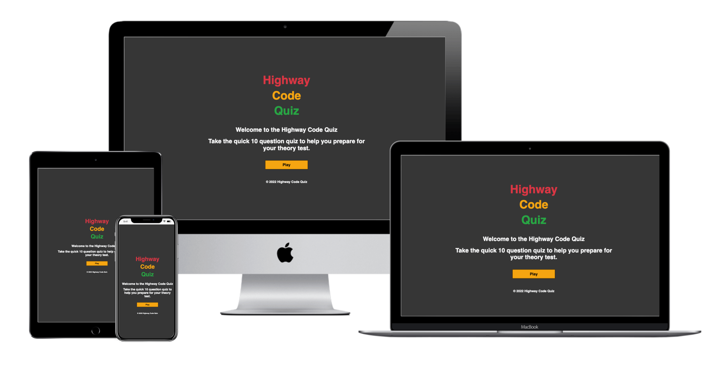
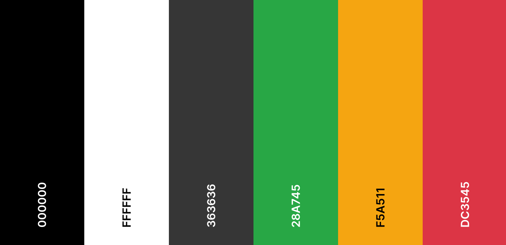
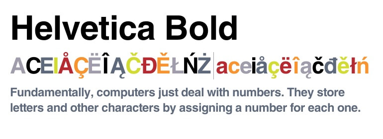

# Highway Code Quiz

Visit the deployed site: [Highway Code Quiz](https://develosi.github.io/highway-code-quiz/) 

Test your highway code knowledge and help prepare for your theory test by using the Highway Code Quiz App. 
The Highway Code Quiz App is a simple easy to use quiz app consisting of ten quick questions. 

This is written in the multiple choice style format as used by the DVLA for the official theory test. 
The app can be used just for fun or to help you revise while on the go to prepare for the types of questions that are asked on the official Theory Test. 

Please note that this app has just been built for proof of concept and should not be used to actually revise for a real world DVLA Theory Test. 

The current questions in the app have been sourced from the free to use test questions supplied by the DVLA on the free to use mock tests. These questions may not actually be used on any official Theory Test. 

This app was designed to work as a stand-alone app to help people brush up on their Highway Code knowledge as well as potentially prepare for a DVLA Theory Test. 

---

## Contents 

* [User Experience](#User-Experience) 
* [User Stories](#User-Stories) 
* [Design](#Design) 
* [Colour Scheme](#Colour-Scheme) 
* [Typography](#Typography) 
* [Wireframes](#Wireframes) 
* [Development Build Process](#Development-Build-Process)
* [Features](#Features) 
* [The Home Page](#The-Home-Page)
* [The Game Page](#The-Game-Page) 
* [The End Page](#The-End-Page) 
* [404 Error Page](#404-Error-Page) 
* [Future Development](#Future-Development) 
* [Accessibility](#Accessibility) 
* [Technologies Used](#Technologies-Used) 
* [Deployment](#Deployment)
* [How to Fork](#How-to-Fork) 
* [How to Clone](#How-to-Clone)
* [Testing](#Testing) 
* [Credits](#Credits)

---

## User Experience 

### User Stories 

#### First time Visitor Goals 

* I want to play the quiz quickly on my phone at any time, anywhere.
* I want the game to be functional and responsive on my device.
* I want the game to be easy to understand and navigate.

#### Returning Visitor Goals

* I want a new set of questions each time I visit so I can revise and learn new areas of the Highway Code.

#### Frequent Visitor Goals

* I want to be able to quickly start playing a new game without the need to log in.
* I want the game questions to be updated on a regular basis so that they are up to date with the latest version of the Highway Code.

---

## Design

### Colour Scheme

I wanted to keep the colour scheme used on the game to be very minimal and take it's inspiration from physical motorway and roadways in the UK. 

The background is kept to a dark grey representing the grey asphalt on the roadways.

I used the red, green and amber colours from the classic British traffic lights. This was used for the main logo and also the background for correct and incorrect answers. The amber is used as a highlight colour for other sections. 

The white was an obvious choice to contrast well against the dark grey 'asphalt' background and is supposed to represent the white markings we see on our roads. 

I was aware that using the colours red and green could be an issue for colour blindness. Taking this into consideration I made sure to add the scoreboard section to help players see their score update if they got a correct or incorrect answer. 

 

### Typography

Helvetica Bold was used throughout the game.

I was looking for a font that closely matched the standard font used on the UK road signs and this worked well. 

Ariel and Sans Serif was used as back up. 

### Wireframes

Wireframes were created using Balsamiq software for mobile, tablet and desktop.

IMAGES GO HERE OF WIREFRAMES *

### Development Build Process

The build process of the game was completed in small incremental sections of code. 
This can be seen in the git commits catalogued within the Github repository that can be found here:
LINK TO REPO COMMITS

Testing was also carried out during the build and all testing documentation can be found within the TESTING.MD file.

### Features

The game is made up of a home page, a games page, an end page and a 404 error page.

All Pages on the website are responsive and have a favicon of the Traffic Light Logo:

FAVICON IMAGE HERE *

#### The Home Page

The home page of the game displays the sites name 'Highway Code Quiz' as a title and then a container which holds a welcome message to the player along with an invite to start the quiz and play the game. 

IMAGE HERE OF HOME PAGE SCREEN *

The play button will take the user to the game page. 

IMAGE HERE OF PLAY BUTTON *

#### The Game Page

On the game page you will be shown a question with four possible multiple choice answers. Each answer is also prefixed with a letter from A to D. 
There is also a heads up display 'HUD' section at the top of the screen so players can keep track of what number question they are on and what their current score is. 

IMAGE HERE OF GAME PAGE * 

Once the user has selected their answer by clicking on it the answer container will either change colour to red if it is incorrect or green if correct.

IMAGE HERE OF GREEN CORRECT ANSWER *

IMAGE HERE OF RED INCORRECT ANSWER *

After the user has selected an answer the game will proceed to the next question and the question number counter will increase till all ten questions are answered. 

IMAGE HERE OF QUESTION NUMBER GOING UP *

Once a user has answered a question and the game proceeds to the next question the score in the HUD section will increase if the previous answer was correct.

IMAGE HERE OF SCORE INCREASING *

#### The End Page

The end page displays the players score along with an invite message to play the game again. This is followed by two buttons, one taking the user to the home page and the other button starting a new game again with refreshed questions.

IMAGE HERE OF END PAGE *

#### 404 Error Page

The 404 error page displays the sites name as a title. There is a 404 error message along with a button taking you back to the home page when clicked on.

IMAGE OF 404 ERROR PAGE HERE *

#### Future Development

In future development and implementations I would like to add the following:

* Give users the option to select the amount of questions in their quiz, options of 20, 50 or 100 questions.
* Add a larger database of more possible questions. At present there is only 20 possible questions, I would like to add a json file or my own API with a database of hundreds of possible questions.
* Offer the ability for users to log in and record their scores. 
* Offer social media sharing for scores so that players can easily share their score results on various platforms. 
* Add more graphics and visual effects with the design to add a more immersive experience to the player. 
* Add more questions that are not just text based but also show images and videos as these are now included in the current UK driving test. 
* Offer links and information for players to help learn the Highway Code and help prepare for their driving test.
* Look into the accessibility for people with colour blindness, adding symbols such as a tick or cross next to the answer when it is selected. 

### Accessibility

I have been mindful to ensure that the website is as accessible as possible. The areas I have focused on:

* Using semantic HTML and aria labels as much as possible.
* Using a HUD section to help players keep track of results and progress in the game.
* Choosing a simple easy to read font for the game with a bold style.
* Ensuring that there is a strong colour contrast throughout the game.
* Extensive A11y and Colour Blindness accessibility testing carried out, results of all testing is in TESTING.md file.

LINK TO TESTING FILE HERE *

---

## Technologies Used

### Languages Used

HTML, CSS, Javascript

### Frameworks, Libraries & Programs Used

* [Balsamiq](https://balsamiq.com/) - Used to create wireframes.

* Jet Brains - Webstorm IDE - Integrated development environment.

* [Github](https://github.com/) - For version control, save and store the files and deployment of site.

* [Google Developer Tools](https://developers.google.com/web/tools) - Testing features, checking responsiveness and styling.

* [TinyPNG](https://tinypng.com/) To compress images

* [Favicon.io](https://favicon.io/) To create favicon.

* [Am I Responsive?](http://ami.responsivedesign.is/) To show the website image on a range of devices.

* DVLA site with test questions 

* [Web Disability Simulator](https://chrome.google.com/webstore/detail/web-disability-simulator/olioanlbgbpmdlgjnnampnnlohigkjla) - a google chrome extension to help check for accessibility issues.

* [Webpage Spell-Check](https://chrome.google.com/webstore/detail/webpage-spell-check/mgdhaoimpabdhmacaclbbjddhngchjik/related) - a google chrome extension that allows you to spell check your webpage.

* Coolers - colour tool 

* jestjs - Javascript testing tool

---

## Deployment & Local Development

### Deployment

The site is deployed using GitHub Pages - LINK TO LIVE SITE HERE *.

To Deploy the site using GitHub Pages:

* Login (or signup) to Github.
* Go to the repository for this project, ******
* Click the settings button.
* Select 'Pages' in the left hand navigation menu.
* From the source dropdown select main branch and press save.
* The site has now been deployed, please note that this process may take a few minutes before the site goes live.

### Local Development

#### How to Fork

To fork the repository:

* Log in (or sign up) to Github.
* Go to the repository for this project, *********
* Click the Fork button in the top right corner.

#### How to Clone

To clone the repository:

* Log in (or sign up) to GitHub.
* Go to the repository for this project, ***********
* Click on the code button, select whether you would like to clone with HTTPS, SSH or GitHub CLI and copy the link shown.
* Open the terminal in your code editor and change the current working directory to the location you want to use for the cloned directory.
* Type 'git clone' into the terminal and then paste the link you copied in step 3. Press enter.

---

## Testing

Please refer to [TESTING.md](TESTING.md) file for all testing completed.

---

## Credits

### Code Used

* I used [this You Tube tutorial]LINK TO VID by *** as the main structure for the game functionality. on YouTube by [James Q Quick]

### Content

All questions for the game are from the free to use mock test provided the UK DVLA, they provide 100 questions I used 20 of those for this project.
Link here to question site ****

All other content for the site, such as introduction and end messages were written by myself.

### Media

Favicon logo was designed and made by myself using Canva software - Link to Canva ****

### Acknowledgments

I would like to acknowledge the following people:

* My Code Institute Mentor and class teacher 

* My fellow class-mates  - For sharing all their struggles and accomplishments along the way with tackling Milestone project 2.

* The Code Institute Slack channel - Thanks you to everyone that takes the time to share their tips and advice.
