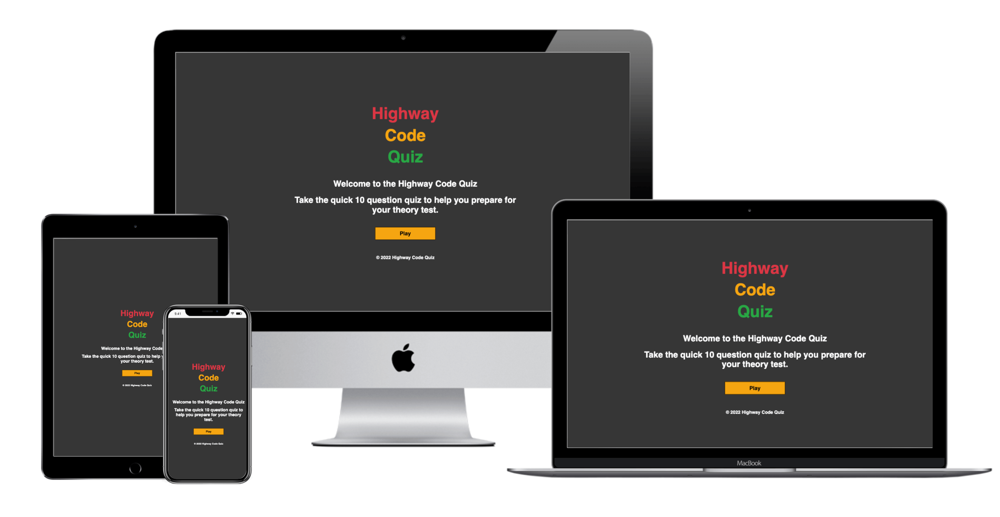

# Highway Code Quiz -  Testing

Visit the deployed site: [Highway Code Quiz](https://develosi.github.io/highway-code-quiz/)

- - -

## CONTENTS

* [AUTOMATED TESTING](#AUTOMATED-TESTING)
    * [W3C Validator](#W3C-Validator)
    * [JavaScript Validator](#JavaScript-Validator)
    * [Lighthouse](#Lighthouse)
* [MANUAL TESTING](#MANUAL-TESTING)
    * [Testing User Stories](#Testing-User-Stories)
    * [Full Testing](#Full-Testing)
* [BUGS](#Bugs) 

Testing was ongoing throughout the build. I utilised Chrome developer tools whilst building to pinpoint and troubleshoot any issues as I went along.

I used the console in the developer tools to work through sections of code and ensure that it was working correctly, and also troubleshoot where needed.

I have gone through each page using google chrome developer tools to ensure that each page is responsive on a variety of different screen sizes and devices.

---

## AUTOMATED TESTING

### W3C Validator

[W3C](https://validator.w3.org/) was used to validate the HTML on all pages. It was also used to validate the CSS file.

* index.html - Passed.
* game.html - Passed with warning for having possible misuse of aria labels in section for selecting answers as these are not strictly buttons. I decided to keep the aria labels in. 
* end.html - Passed with 1 warning for having an empty heading in line 19. This data is pulled from the js file. 
* 404.html - Passed.
* style.css - Passed.

---

### JavaScript Validator

[jshint](https://jshint.com/) was used to validate the JavaScript.
I used the built-in jshint and jslint that is installed within webstorm IDE. 

I get a warning for having '== instead of using ===' on line 224. 
This is also logged in my Bugs report below. 
The function does not work with strict equality '==='. 
I decided to keep it as it is for now and with more time would have liked to have found an alternative solution for this.

---

### Lighthouse

Google Lighthouse within the Chrome Developer Tools was used to test for performance, accessibility, best practices and SEO.

### Desktop Results

Results for the site based on desktop viewing.

### Mobile Results

Results for the site for mobile viewing. 

---

## MANUAL TESTING

### Testing User Stories

`First Time Visitors`

| Goals | How are they achieved?                                                                                                                  |
| :--- |:----------------------------------------------------------------------------------------------------------------------------------------|
| I want to take to play the quiz quickly on my phone at any time, anywhere. | The Highway Code Quiz is designed in such a way that it is quick and easy to start a new game and is designed for mobile display first. |
| I want the game to be functional and responsive to my device. | The site is designed to be fully responsive and work on any device.                                                                     |
| I want the game to be easy to understand and navigate. | High contrast text and clearly marked buttons are used throughout the site for easy navigation.                                         |

`Returning Visitors`

|  Goals | How are they achieved?                                                                                                                                                       |
| :--- |:-----------------------------------------------------------------------------------------------------------------------------------------------------------------------------|
| I want a new set of questions each time I visit so I can revise and learn new areas of the Highway Code. | Users will be provided with a new random selection of questions for each game. For proof of concept this project has a selection of just twenty questions that will be used. |

`Frequent Visitors`

| Goals | How are they achieved?                                                                                                                                                       |
| :--- |:-----------------------------------------------------------------------------------------------------------------------------------------------------------------------------|
| I want to be able to quickly start playing a new game without the need to log in. | Users are able to start a new game without the need to log in or provide any details.                                                                                        |
| I want the game questions to be updated on a regular basis so that they are up to date and current with the latest version of the Highway Code. | The game has questions taken from the latest version of the Highway Code theory test. Longer term these questions could be updated easily without affecting the game design. |

---

### Full Testing

Full testing was performed on the following devices:

* Laptop:
  * Macbook Pro 2020 13 inch screen
  * Macbook Pro 2020 ext 27 inch monitor
* Mobile Devices:
  * iPhone 7 plus.
  * iPhone 6.

Each device tested the site using the following browsers:

* Google Chrome
* Safari
* Firefox

Additional testing was taken by friends and family on a variety of devices. 

On the home page screen when on the physical iPhone 6 safari browser the top of the word 'Highway' cutoff from the top of the screen.
While using chrome developer tools and emulating other various device screen sizes all sections of the homepage and game were visible and accessible. 

`Home Page`

| Feature               | Expected Outcome                                                       | Testing Performed | Result                    | Pass/Fail |
|-----------------------|------------------------------------------------------------------------| --- |---------------------------| --- |
| Play Button           | Directs the user to the game page                                      | Clicked on button | Game page opens | Pass |
| Button - hover effect | Play button should show drop shadow affect and move when hovered over. | Hover over each button on the page | Button displayed the correct styling when hovered over | Pass |

`Game Page`

| Feature                              | Expected Outcome                                                                                                                                                                 | Testing Performed                                                                                                         | Result                                                                                                                       | Pass/Fail |
|--------------------------------------|----------------------------------------------------------------------------------------------------------------------------------------------------------------------------------|---------------------------------------------------------------------------------------------------------------------------|------------------------------------------------------------------------------------------------------------------------------| --- |
| Answer buttons - hover effect        | Answer buttons have a dropshadow affect when hovered over.                                                                                                                       | Hover over each answer button.                                                                                            | Each button displayed the correct styling when hovered over.                                                                 | Pass |
| Question populated                   | The question from the game.js file is correctly pulled and displayed.                                                                                                            | Check that the question has been pulled correctly and displayed at start of each turn.                                    | The question is displaying.                                                                                                  | Pass |
| Answers populated                    | The multiple choice answers from the game.js file are correctly pulled and displayed.                                                                                            | Check that the multiple choice answers have been pulled and match the question.                                           | The answers are displaying.                                                                                                  | Pass |
| Correct answer - background colour   | When a correct answer is clicked the background colour of the selected answer displays green.                                                                                    | Clicked on a correct answer.                                                                                              | Background displayed green.                                                                                                  | Pass |
| Incorrect answer - background colour | When an incorrect answer is clicked the background colour of the selected answer displays red.                                                                                   | Clicked incorrect answer.                                                                                                 | Background displayed red.                                                                                                    | Pass |
| Question number counter              | The Question number counter should start at 1/10 and increase by 1 after each question is answered.                                                                              | Answered questions by clicking on them.                                                                                   | Each time the answer is clicked the question number counter increases by 1.                                                  | Pass |
| Score counter                        | The score counter should begin at 0. Each time a correct answer is selected the score should increase by 1. If an incorrect answer is selected the score should remain the same. | Clicked a correct answer to check if the score increased. Clicked an incorrect answer to check the score stayed the same. | When a correct answer was selected the score increased by 1. When an incorrect score was selected the score stayed the same. | Pass |
| Next question - becomes visible      | When an answer is clicked the next question should be displayed so the user can progress through the game till all 10 questions have been answered.                              | Clicked on an answer button.                                                                                              | The next question was displayed.                                                                                             | Pass |

`End Page`

| Feature                | Expected Outcome                                                                       | Testing Performed                                                 | Result                                                   | Pass/Fail |
|------------------------|----------------------------------------------------------------------------------------|-------------------------------------------------------------------|----------------------------------------------------------| --- |
| Buttons - hover effect | All buttons change when hovered over with a dropshadow and move.                       | Hover over each button.                                           | Buttons displayed the correct styling when hovered over. | Pass |
| Score displayed        | The 'You Scored' area should populate with the score you have achieved.                | I added my score as I played and compared to the score displayed. | The score displays correctly.                            | Pass |
| Play Again button      | Clicking on this button will return you to the start of the game page with a new game. | Clicked on the Play Again button.                                 | Taken to the game page to start a new game.              | Pass |
| Go Home button         | Clicking on this button will take you back to the home page.                           | Clicked the Go Home button.                                       | Taken back to the home page.                             | Pass |

`404 Error Page`

| Feature               | Expected Outcome                                              | Testing Performed              | Result                                                              | Pass/Fail |
|-----------------------|---------------------------------------------------------------|--------------------------------|---------------------------------------------------------------------| --- |
| Button - hover effect | Button changes when hovered over with a dropshadow and moves. | Hover over button on the page. | The button is displayed with the correct styling when hovered over. | Pass |
| Go Home button        | Takes the user back to the home page.                         | Clicked the button.            | Taken to the home page.                                             | Pass |

---

## BUGS

### Solved Bugs

| No | Bug                                                                                 | How I solved the issue                                                                                                                                           |
|---|:-----------------------------------------------------------------------------------|:-----------------------------------------------------------------------------------------------------------------------------------------------------------------|
| 1 | Correct answers not getting registered.                                            | choice-text in css file was not set up to be 100% width of the div so it wasn't getting registered when clicked on outside of that area.                         |
| 2 | Game not going straight to end page after questions all answered.                  | The link was not set up correctly in the getNewQuestion function so the return location assigned was taking the user directly to the end page. I fixed the link. |
| 3 | Game page not linking up correctly to the home page when clicking on Play button.  | Fixed the link address to open game page on Play button.                                                                                                         |
| 4 | Question counter not displaying correct question number.                           | I had the question counter set up so it was starting at '1'. It should have been set up to start at '0'.                                                         |
| 5 | Prefix section of answers not being displayed correctly with inconsistent spacing. | I changed the padding to 'rem' so that 2.5rem was all around the prefix letter. This then made the padding the same on all device screen sizes.                  |

### Known Unresolved Bugs

* When viewing on mobile devices with a small screen the top of the main title gets cut off on some devices (known to be iPhone 6). The app is displayed well on virtual mobile screens of all sizes though it seems in real world some smaller device screens have issues. I should have adjusted the main title spacing to fix this.

* JShint testing and built in debugging within Webstorm IDE states a strong warning for having a double equals '==' instead of a strict '===' within the code on line 224. If I had enough time I would have like to rewritten this function in another way so that '==' was not needed to be used to make it work.

* Google chrome developer tools still gives an error for 'Permission-Policy header: Origin trial comntrolled feature not enabled. I have looked into this on multiple sources online and this seems to be an issue with hosting on Github pages. Github pages will; disable Googles 3rd party cookie alternative 'FLoc' which causes the error. I deciced to leave it as it is.